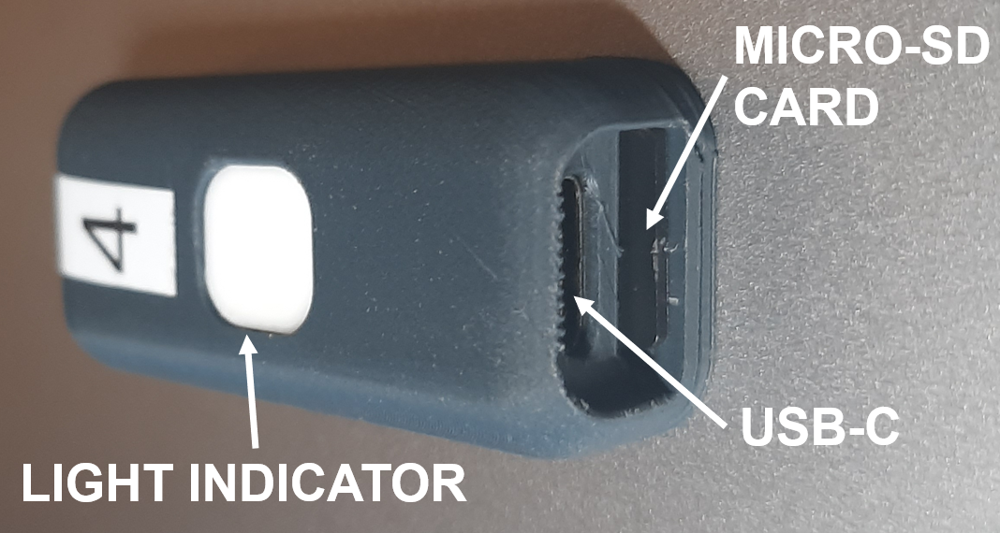
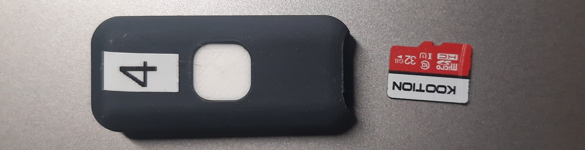
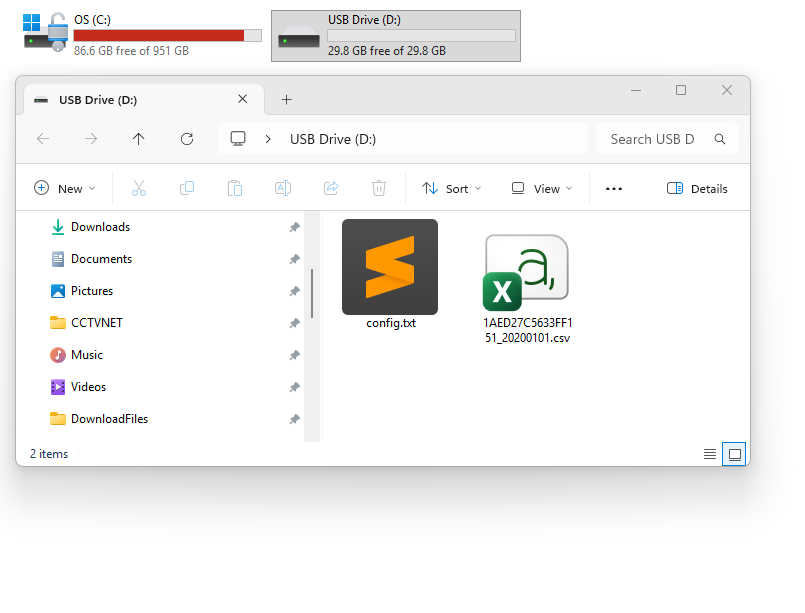
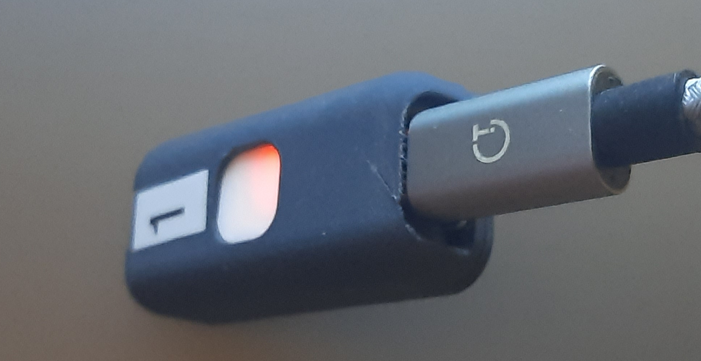
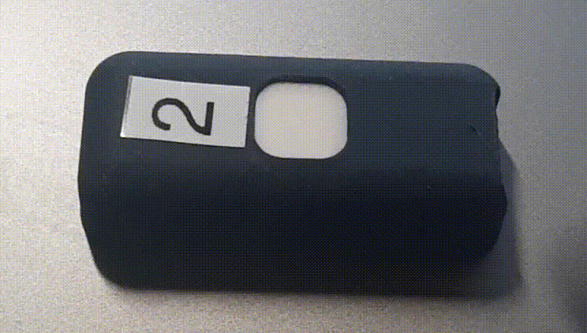
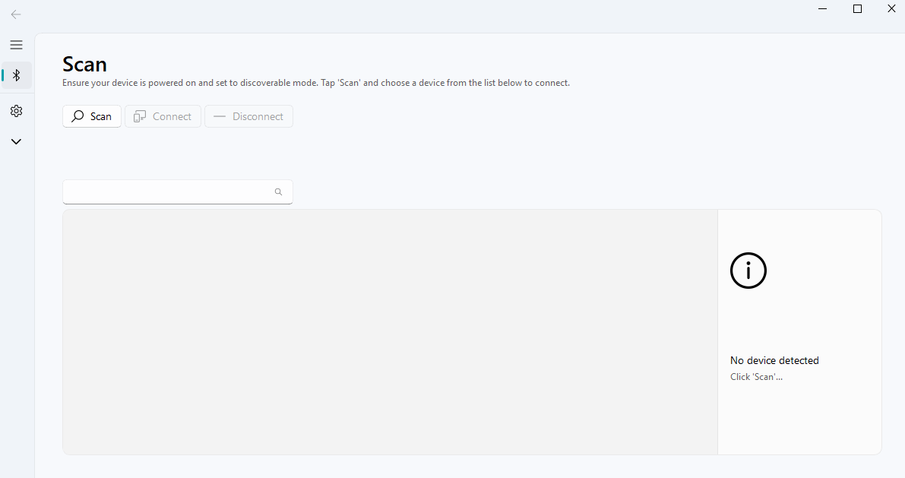
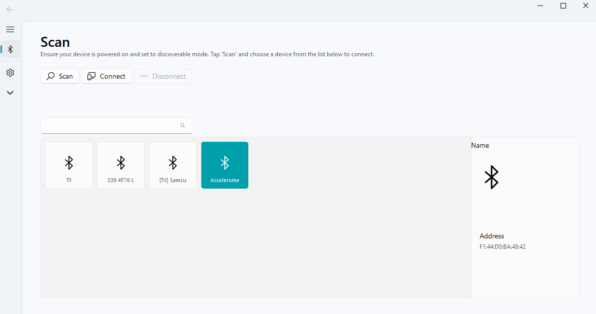
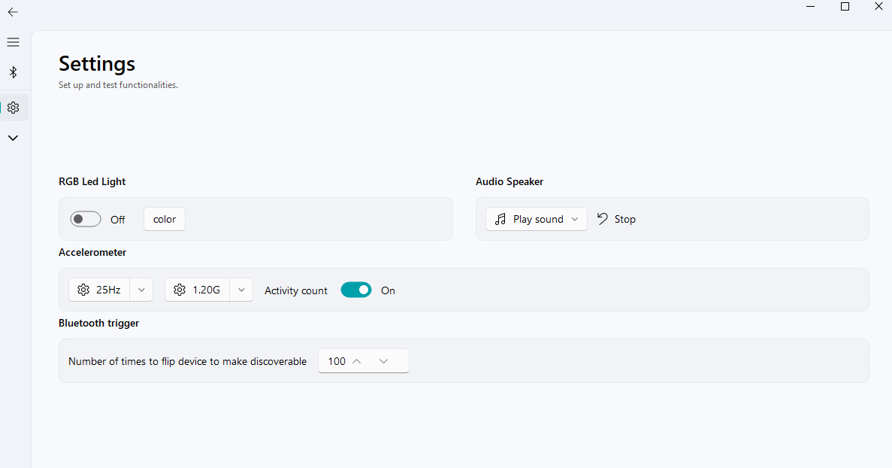
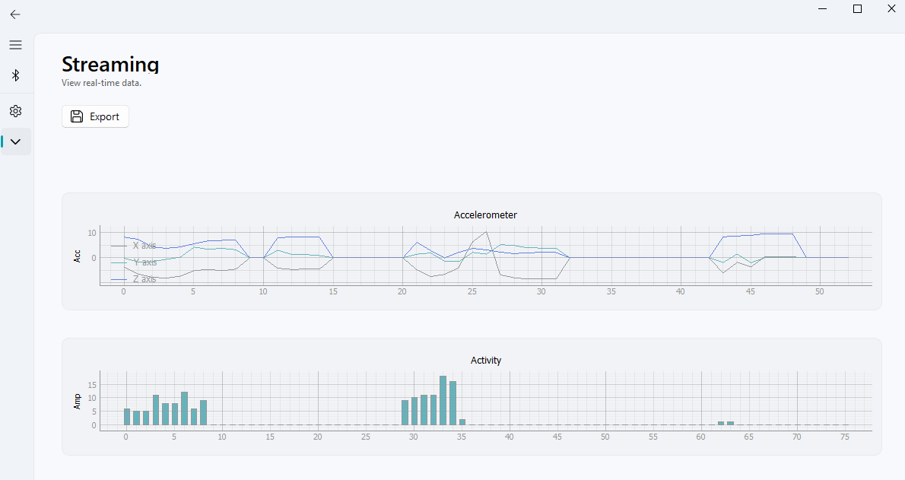
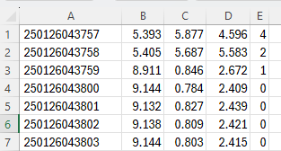

# Wearable Accelerometer Desktop Client

This application uses QFluentWidgets framework https://qfluentwidgets.com

This repository contains the source code for wearable accelerometer Desktop Client.

## Prerequisites

- Python 3.7 or <= 3.12

## Installation

1. Clone the repository and navigate to the project directory.

```bash
https://github.com/biospi/wearableAccelerometerClient.git
cd wearableAccelerometerClient
```

2. Create a virtual environment 
```bash
python -m venv .venv
.\.venv\Scripts\activate    # Windows
source .venv/bin/activate   # macOS/Linux
```

3. Install the required dependencies.

You can install the required dependencies by running:

```bash
pip install -r requirements.txt
pip install "PyQt-Fluent-Widgets[full]" -i https://pypi.org/simple/
```

## Running the Application

To launch the GUI, run the following command:

```bash
python gui.py
```

This will open the main window of the application. If your system has DPI scaling enabled, the application will automatically adjust accordingly.


## Building the Executable (Windows)

You can package this into a single .exe file so that collaborators don’t need Python installed.

```bash
pyinstaller --onefile --noconsole .\src\gallery\gui.py
```

## Quick Start
<p align="center">
  
</p>

This section should get you started collecting accelerometer data from the wearable accelerometer.
Wou will need:
* Wearable accelerometer
* Micro SD card (FAT32 formatted)
<p align="center">
  
</p>

* Magnet
* USB-C cable
* Bluetooth capable laptop 
* The "Wearable Accelerometer Desktop Client" software from this repository. For Windows PC binaries are available [here](https://github.com/biospi/wearableAccelerometerClient/releases/tag/v1.0.0)

### 1. Prepare the micro SD 
If not already formatted, format the micro sd (FAT32)
<p align="center">
  
</p>

**Optional:**

> [!NOTE]
> If you choose to create a config.txt file at the root of the micro-SD card, you can override the device’s default sensor and logging behavior.
> Below is a description of each available parameter.


| Parameter           | Description                                                                                                                                                |
| ------------------- | ---------------------------------------------------------------------------------------------------------------------------------------------------------- |
| **xyz_sens**        | Sets the XYZ sensor sensitivity (e.g., accelerometer gain). Higher values make the system more responsive to smaller movements.                            |
| **xyz_sampling**    | Sampling rate in Hz. Determines how many sensor samples are captured per second. Higher values increase accuracy but also power usage and file size.       |
| **xyz_buffer_size** | Size of the internal buffer (in samples). Larger buffers reduce the risk of overflow but require more RAM.                                                 |
| **flip_count**      | Maximum number of "flip" events the device will detect before enabling Bluetooth discovery                                                                 |
| **count_only**      | When set to `1`, the device saves activity counts. When `0`, full data (x,y,z, activity_count) logging is enabled.                                         |
| **no_log**          | When set to `1`, disables logging to the SWD port. When `0`, logging is enabled as normal.                                                                 |


### 2. Charging
Plug a USB-C cable in the accelerometer port with a standard (5V 1-3A) power source, like a laptop or a smartphone charging brick.
The LED indicator will light up solid red indicating that the device is charging.
<p align="center">
  
</p>

### 3. Turn on and start recording data
To turn on the device briefly swipe a magnet over the top. When the device turns on, the light indicator will briefly flash white.
<p align="center">
  
</p>
The accelerometer is now automatically saving data to the micro-sd card, it will automatically go to sleep when no motion is detected and wake up when motion is detected.

You are now ready to place the accelerometer on a subject, to access the data simply remove the micro-sd card and read it on your computer.

> [!NOTE]
> To manually turn off the device swipe the opposite side of the magnet over the top of the device.


### 4. Bluetooth connection 
Connecting to the device via the ["Wearable Accelerometer Desktop Client"](https://github.com/biospi/wearableAccelerometerClient/releases/tag/v1.0.0) allows to:
* Set the accelerometer internal clock (automatic on first connection)
* Configure the accelerometer sensitivity and sampling rate
* Stream and visualise the accelerometer data in real time

**To enable Bluetooth discovery hold a magnet 5 seconds above the top of the device. The light indicator will blink blue to confirm that the device is now discoverable**

<p align="center">
  
</p>

Make sure that Bluetooth is enabled on your laptop and open Connecting to the device via the ["Wearable Accelerometer Desktop Client"](https://github.com/biospi/wearableAccelerometerClient/releases/tag/v1.0.0)

1. click the "Scan button"
<p align="center">
  
</p>

2. Select the "Accelerometer" in the list
<p align="center">
  
</p>

3.  On the left menu select the gear icon to access the setting menu
<p align="center">
  
</p>

4. On the left menu select the "arrow down" icon  to access the data streaming menu
<p align="center">
  
</p>

### 4. Data
Once powered on, the device automatically begins recording motion data to an MS Excel–compatible **CSV file**.
Each row represents one sample collected at a fixed sampling rate.
A typical data snippet looks like:
<p align="center">  </p>

| Column | Name               | Description                                                                                                                                                                                                                                        |
|--------| ------------------ | -------------------------------------------------------------------------------------------------------------------------------------------------------------------------------------------------------------------------------------------------- |
| **A**  | **Timestamp**      | A 12-digit timestamp in the format **YYMMDDhhmmss**:<br>• **YY** – year<br>• **MM** – month<br>• **DD** – day<br>• **hh** – hour (24-hour format)<br>• **mm** – minutes<br>• **ss** – seconds<br>Example: `250126043757` → **2025-01-26 04:37:57** |
| **B**  | **X-axis**         | Raw acceleration value along the X axis (units depend on device configuration, commonly *g* or m/s²).                                                                                                                                              |
| **C**  | **Y-axis**         | Raw acceleration value along the Y axis.                                                                                                                                                                                                           |
| **D**  | **Z-axis**         | Raw acceleration value along the Z axis.                                                                                                                                                                                                           |
| **E**  | **Activity Count** | A derived value representing the estimated activity level at that timestamp.                                                                                                                                            |

A sample cat dataset is available [here](https://github.com/biospi/wearableAccelerometerClient/dataset/data.zip)

> [!NOTE]
> Depending on the device configuration, not all columns may be present.
For example, if count_only mode is enabled, only the Activity Count column will be recorded in the CSV file.


## License

This project is licensed under the GPLv3 License. See the [LICENSE](LICENSE) file for details.